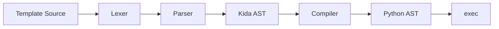

# Architecture

Kida's compilation and rendering pipeline.

## Overview



## Pipeline Stages

### 1. Lexer

Tokenizes template source into a stream of tokens.

```python
from kida.lexer import Lexer, LexerConfig

lexer = Lexer("Hello, {{ name }}!", LexerConfig())
tokens = list(lexer.tokenize())
# [DATA("Hello, "), VARIABLE_BEGIN, NAME("name"), VARIABLE_END, DATA("!"), EOF]
```

**Token types**:
- `DATA` — Raw text content
- `VARIABLE_BEGIN` / `VARIABLE_END` — `{{` and `}}`
- `BLOCK_BEGIN` / `BLOCK_END` — ``
- `NAME`, `STRING`, `INTEGER`, `FLOAT` — Expression tokens

### 2. Parser

Builds an immutable Kida AST from the token stream.

```python
from kida.parser import Parser

parser = Parser(tokens, name="template.html", filename="template.html", source=source)
ast = parser.parse()
```

**AST nodes**:
- `Template` — Root container
- `Data` — Static text
- `Output` — `{{ expr }}`
- `If`, `For`, `Match` — Control flow
- `Block`, `Extends` — Inheritance

### 3. Compiler

Transforms Kida AST to Python AST directly.

```python
from kida.compiler import Compiler

compiler = Compiler(env)
code = compiler.compile(ast, name="template.html")
# Returns compiled code object
```

**Key difference from Jinja2**: Kida generates `ast.Module` objects directly, not Python source strings. This enables:
- Structured code manipulation
- Compile-time optimization
- Precise error source mapping

### 4. Template

Wraps the compiled code with the render interface.

```python
# Templates are created internally by Environment
# Direct construction (for reference):
template = Template(env, code, name="template.html", filename="template.html")
html = template.render(name="World")
```

## Rendering

Kida uses the **StringBuilder pattern** for O(n) rendering:

```python
# Generated render function (simplified)
def _render(context):
    _out = []
    _out.append("Hello, ")
    _out.append(_escape(context["name"]))
    _out.append("!")
    return "".join(_out)
```

**Benefits**:
- O(n) string construction (vs O(n²) concatenation)
- Lower memory churn than generators
- Faster than yield-based approaches (see [[docs/about/performance|benchmarks]])

### RenderContext

Per-render state is managed via `RenderContext` (ContextVar-based):

```python
from kida.render_context import RenderContext, render_context

@dataclass
class RenderContext:
    template_name: str | None = None
    line: int = 0                    # Updated during render for errors
    include_depth: int = 0           # DoS protection for circular includes
    cached_blocks: dict[str, str]    # Site-scoped block cache
```

**Key benefit**: User context is completely clean—no internal keys like `_template` or `_line` are injected. Error tracking and include depth are managed in the ContextVar.

### Render Profiling

Opt-in profiling via `RenderAccumulator`:

```python
from kida.render_accumulator import profiled_render

with profiled_render() as metrics:
    html = template.render(page=page)

print(metrics.summary())
# {"total_ms": 12.5, "blocks": {...}, "includes": {...}}
```

Zero overhead when disabled (default).

## Caching Architecture

Three cache layers:

### Bytecode Cache (Disk)

Persists compiled bytecode via `marshal`:

```python
from pathlib import Path
from kida.bytecode_cache import BytecodeCache

cache = BytecodeCache(Path(".kida-cache"))
cache.set(name, source_hash, code)
cached = cache.get(name, source_hash)
```

**Benefits**: Significant cold-start improvement for serverless deployments.

### Template Cache (Memory)

LRU cache of compiled Template objects:

```python
env = Environment(cache_size=400)
info = env.cache_info()["template"]
# {'size': 50, 'max_size': 400, 'hits': 1000, 'misses': 50}
```

### Fragment Cache (Memory)

TTL-based cache for `` blocks:

```python
env = Environment(
    fragment_cache_size=1000,
    fragment_ttl=300.0,  # 5 minutes
)
```

## Design Principles

### 1. AST-Native

No string manipulation or regex. The entire pipeline operates on structured AST objects.

### 2. Free-Threading Ready

- Compilation is idempotent
- Rendering uses only local state
- Caches use atomic operations
- No shared mutable state

### 3. Zero Dependencies

Pure Python, no runtime dependencies. Includes native `Markup` class.

## See Also

- [[docs/about/performance|Performance]] — Benchmarks
- [[docs/about/thread-safety|Thread Safety]] — Free-threading details
- [[docs/reference/api|API Reference]] — Public interface
