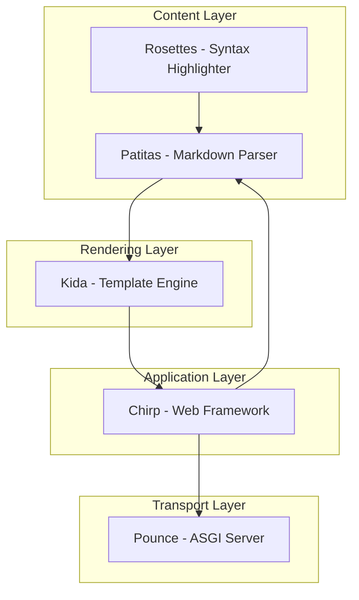

# Python Components Ecosystem

Kida is the server-side component layer in a broader pure-Python stack for
Python 3.14t. The projects can be adopted independently; Kida does not require
the surrounding stack or any runtime dependency.

## Stack Overview

| | | | |
|--:|---|---|---|
| **⌁⌁** | [Chirp](https://github.com/lbliii/chirp) | Web framework | [Docs](https://lbliii.github.io/chirp/) |
| **=^..^=** | [Pounce](https://github.com/lbliii/pounce) | ASGI server | [Docs](https://lbliii.github.io/pounce/) |
| **)彡** | **Kida** | Server-side component system ← You are here | [Docs](https://lbliii.github.io/kida/) |
| **ฅᨐฅ** | [Patitas](https://github.com/lbliii/patitas) | Markdown parser | [Docs](https://lbliii.github.io/patitas/) |
| **⌾⌾⌾** | [Rosettes](https://github.com/lbliii/rosettes) | Syntax highlighter | [Docs](https://lbliii.github.io/rosettes/) |
| **ᓃ‿ᓃ** | [Milo](https://github.com/lbliii/milo-cli) | Terminal UI framework | [Docs](https://lbliii.github.io/milo-cli/) |
| **∿∿** | [Purr](https://github.com/lbliii/purr) | Content runtime | — |
| **ᓚᘏᗢ** | [Bengal](https://github.com/lbliii/bengal) | Legacy static-site integration | [Docs](https://lbliii.github.io/bengal/) |

Python-native. Free-threading ready. No npm required.

## How Each Project Uses Kida

| Project | Kida usage |
|---------|------------|
| **Chirp** | Full render, `render_block`, `render_with_blocks`, streaming, `template_metadata` |
| **Milo** | Terminal rendering and interactive application surfaces |
| **Bengal (legacy)** | Full render, bytecode cache, fragment cache, analysis for incremental builds |
| **Standalone** | `render`, `render_stream`, custom loaders |
