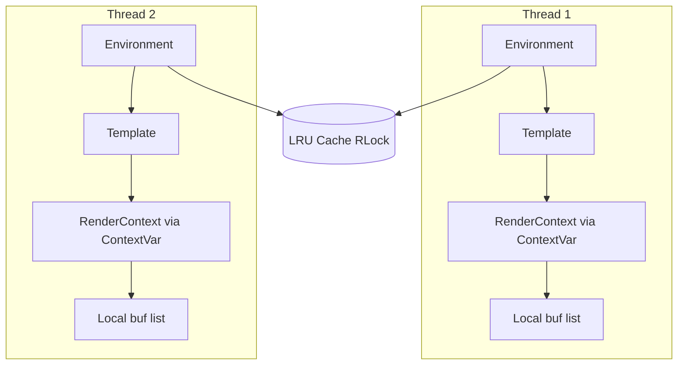

# Thread Safety

Kida is designed for concurrent rendering in free-threaded Python.

## Free-Threading Support

Kida declares GIL-independence via PEP 703:

```python
# In kida/__init__.py
def __getattr__(name):
    if name == "_Py_mod_gil":
        return 0  # Py_MOD_GIL_NOT_USED
```

This signals that Kida is safe for true parallel execution in Python 3.14t+.

## Thread-Safe Design

### Immutable Configuration

Environment configuration is frozen after construction:

```python
env = Environment(
    loader=FileSystemLoader("templates/"),
    autoescape=True,
)
# Configuration is now immutable
```

### Copy-on-Write Updates

Adding filters/tests creates new dictionaries:

```python
def add_filter(self, name, func):
    # Copy-on-write: no locking needed
    new_filters = self._filters.copy()
    new_filters[name] = func
    self._filters = new_filters
```

### RenderContext Isolation

Each `render()` call creates an isolated `RenderContext` via ContextVar:

```python
from kida.render_context import render_context

def render(self, **context):
    with render_context(template_name=self._name) as ctx:
        _out = []  # Local buffer
        # ctx.line updated during render for error tracking
        # No internal keys pollute user context
        return "".join(_out)
```

**Benefits**:
- **Thread isolation**: ContextVars are thread-local by design
- **Async safety**: Propagates correctly to `asyncio.to_thread()` in Python 3.14
- **Clean user context**: No internal keys (`_template`, `_line`) injected

No shared mutable state between render calls.

### Thread-Safe Caching

LRU caches use an internal `RLock` for safe concurrent access:

```python
# Thread-safe cache access (RLock-protected internally)
cached = self._cache.get(name)
self._cache.set(name, template)
```

## Concurrency Model



- **Template**: Immutable after construction; safe to share across threads.
- **RenderContext**: Isolated per render via ContextVar; no cross-thread leakage.
- **Cache**: Protected by internal RLock; concurrent get/set is safe.

## When to Use Locks

If you add **custom filters** or **globals** that touch shared mutable state, you must protect that state:

```python
import threading

_shared_counter_lock = threading.Lock()
_shared_counter = 0

def counting_filter(value):
    global _shared_counter
    with _shared_counter_lock:
        _shared_counter += 1
    return str(value)

env.add_filter("counted", counting_filter)
```

**Guidance**:
- Prefer **stateless** filters: same inputs always produce same output.
- If state is needed, use `threading.Lock` or `contextvars` for isolation.
- Avoid module-level mutable dicts/lists that filters modify without protection.

## Macro and Import Isolation

When using `` or ``, each child template gets an **isolated copy** of `import_stack` and `template_stack`. No shared mutable state flows across the extends/import chain. This ensures:

- Parallel renders of different pages do not interfere.
- Nested macro calls have correct attribution in error traces.
- Circular import detection works per-render without cross-thread races.

## Free-Threading Design Principles

Kida's concurrency model follows these principles. When extending or modifying Kida, preserve them:

- **Copy on fork:** When creating child contexts (includes, extends, imports), copy mutable state (e.g. `import_stack`) instead of sharing. Each level of the extends/import chain must have isolated state. Sharing mutable state across parallel renders can cause cross-thread interference.

- **No shared mutable state in hot paths:** Caches use locks or per-call isolation. Render state lives in ContextVar, not globals. Avoid unprotected shared dicts in render paths.

- **ContextVar for per-call state:** All render-scoped state (template name, line, blocks, import stack) lives in `RenderContext` via ContextVar. This ensures each render call has isolated state regardless of thread or async context.

## Concurrent Rendering

### With ThreadPoolExecutor

```python
from concurrent.futures import ThreadPoolExecutor
from kida import Environment, FileSystemLoader

env = Environment(loader=FileSystemLoader("templates/"))
template = env.get_template("page.html")

def render_page(context):
    return template.render(**context)

contexts = [{"name": f"User {i}"} for i in range(100)]

# On Python 3.14t, this runs with true parallelism
with ThreadPoolExecutor(max_workers=4) as executor:
    results = list(executor.map(render_page, contexts))
```

### With asyncio

```python
import asyncio

async def render_many(env):
    template = env.get_template("page.html")

    # Use asyncio.to_thread() for true parallel rendering on 3.14t
    tasks = [
        asyncio.to_thread(template.render, user=f"User {i}")
        for i in range(100)
    ]
    return await asyncio.gather(*tasks)
```

## What's Safe

| Operation | Thread-Safe |
|-----------|-------------|
| `get_template()` | ✅ Yes |
| `from_string()` | ✅ Yes |
| `template.render()` | ✅ Yes |
| `template.render_stream()` | ✅ Yes |
| `add_filter()` | ✅ Yes (copy-on-write) |
| `add_test()` | ✅ Yes (copy-on-write) |
| `add_global()` | ✅ Yes (copy-on-write) |
| `clear_cache()` | ✅ Yes |

Concurrent `render()` and `render_stream()` on the same template from different threads is safe. BytecodeCache and Environment copy-on-write are tested under concurrent get/set.

## Component Concurrency Matrix

| Component | Concurrent Reads | Concurrent Writes | Notes |
|-----------|------------------|------------------|-------|
| `Environment.get_template` | Yes | Yes (LRU locked) | Cache dicts protected by `_cache_lock` |
| `Template.render` | Yes | N/A | Per-call state via ContextVar |
| `CachedBlocksDict` | Yes | Stats safe | Stats updates use lock when shared |
| `Compiler.compile` | No | No | One compile at a time per Compiler instance |

## Best Practices

### Create Environment Once

```python
# ✅ Create once, reuse everywhere
env = Environment(loader=FileSystemLoader("templates/"))

def handle_request(request):
    template = env.get_template(request.path)
    return template.render(**request.context)
```

### Macro Import Patterns

- **Use ``** — Ensure the imported template defines the requested macro. If the macro is missing, Kida raises `TemplateRuntimeError` with `ErrorCode.MACRO_NOT_FOUND` at import time.
- **Extends + import** — When using `` and ``, each child gets an isolated `import_stack`; no shared mutable state. See "Copy on fork" in Free-Threading Design Principles.
- **Import macros only** — `` expects `y` to be a macro (callable). Do not import filters or other globals this way.

### Don't Mutate During Rendering

```python
# ❌ Don't add filters during concurrent rendering
def render_with_filter(value):
    env.add_filter("custom", custom_func)  # Race condition!
    return template.render(value=value)

# ✅ Add filters at startup
env.add_filter("custom", custom_func)

def render(value):
    return template.render(value=value)
```

### Use Template Caching

```python
# Templates are compiled once, then cached
# Concurrent get_template() calls for the same name
# wait for the first compilation to complete
template = env.get_template("page.html")
```

## Performance with Free-Threading

> Numbers from `benchmarks/test_benchmark_full_comparison.py` (Python 3.14.2 free-threading, Apple Silicon).

### Kida Scaling (vs single-threaded baseline)

| Workers | Time | Speedup |
|---------|------|---------|
| 1 | 1.80ms | 1.0x |
| 2 | 1.12ms | 1.61x |
| 4 | 1.62ms | 1.11x |
| 8 | 1.76ms | 1.02x |

### Kida vs Jinja2 (Concurrent)

| Workers | Kida | Jinja2 | Kida Advantage |
|---------|------|--------|----------------|
| 1 | 1.80ms | 1.80ms | ~same |
| 2 | 1.12ms | 1.15ms | ~same |
| 4 | 1.62ms | 1.90ms | **1.17x** |
| 8 | 1.76ms | 1.97ms | **1.12x** |

**Key insight**: Jinja2 shows *negative scaling* at 4+ workers (slower than 1 worker), indicating internal contention. Kida's thread-safe design avoids this.

## Code References

| Pattern | File |
|---------|------|
| PEP 703 declaration | [src/kida/__init__.py](https://github.com/lbliii/kida/blob/main/src/kida/__init__.py) |
| RenderContext (ContextVar) | [src/kida/template/core.py](https://github.com/lbliii/kida/blob/main/src/kida/template/core.py) |
| Copy-on-write filters | [src/kida/environment.py](https://github.com/lbliii/kida/blob/main/src/kida/environment.py) |
| Free-threading detection | [src/kida/utils/workers.py](https://github.com/lbliii/kida/blob/main/src/kida/utils/workers.py) |

## See Also

- [[docs/about/architecture|Architecture]] — Rendering internals
- [[docs/about/performance|Performance]] — Optimization tips
- [[docs/syntax/async|Async]] — Async template rendering
